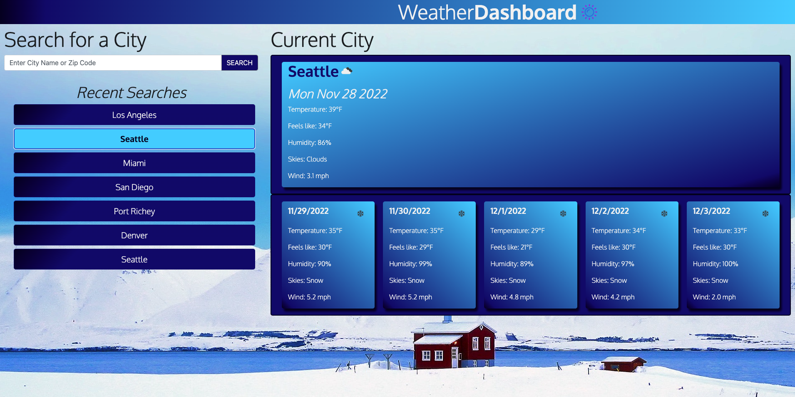

# WEEKLY WEATHER DASHBOARD

## Description

Browser based application featuring a 5-day forecast, current weather and saved search history.

- The motivation behind the project was to cleanly incorporate a third-party API, client-side storage and a simple Bootstrap framework.
- This application allows the user to check the current and forecasted weather quickly from their desktop computer.
- Learned topics include parsing third-party data, JavaScript date and time functionality and further cementing an understanding of Bootstrap.

## Table of Contents

- [Installation](#installation)
- [Usage](#usage)
- [Credits](#credits)
- [License](#license)

## Installation

Copy and paste the provided URL into your favorite browser.

## Usage

Enter a city or zip code and click 'Seach' or simply hit 'Enter' on your keyboard.  The forecast will dynamically appear!

## Credits

Google Fonts, Bootstrap, Pexels

## License

MIT License

## Questions

- Email: putzstuck@gmail.com
- GitHub Profile: https://github.com/argounova